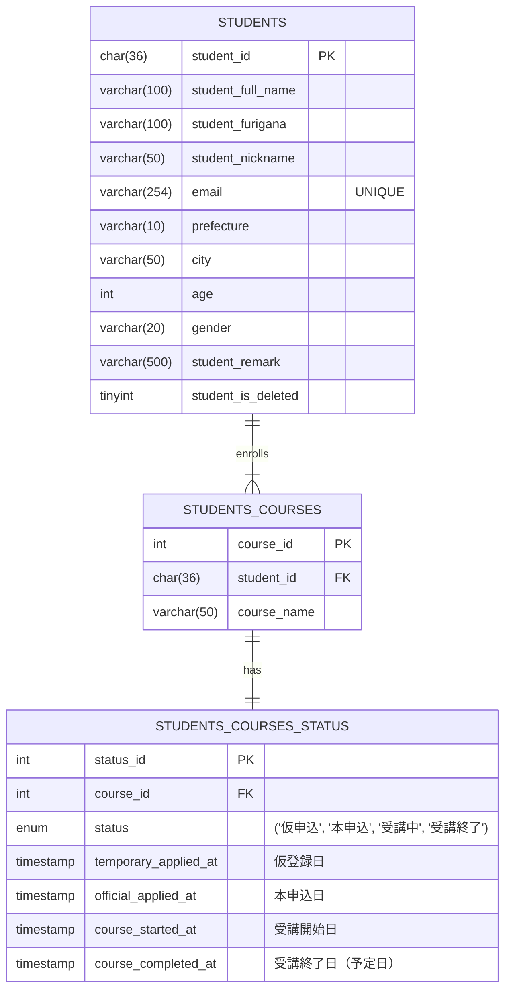
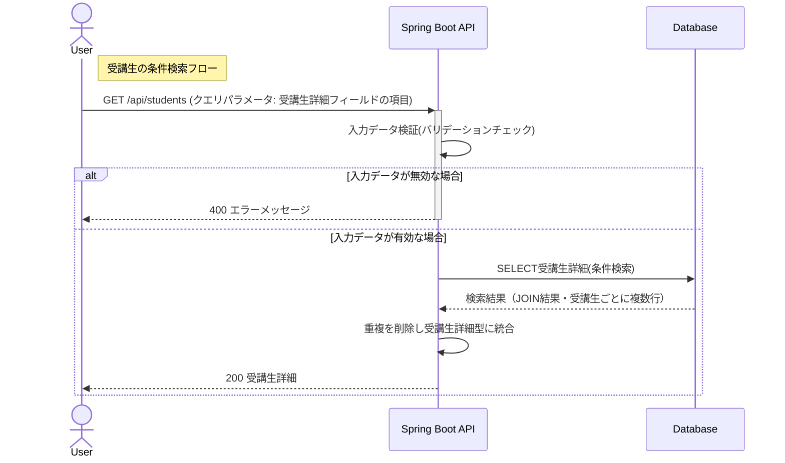
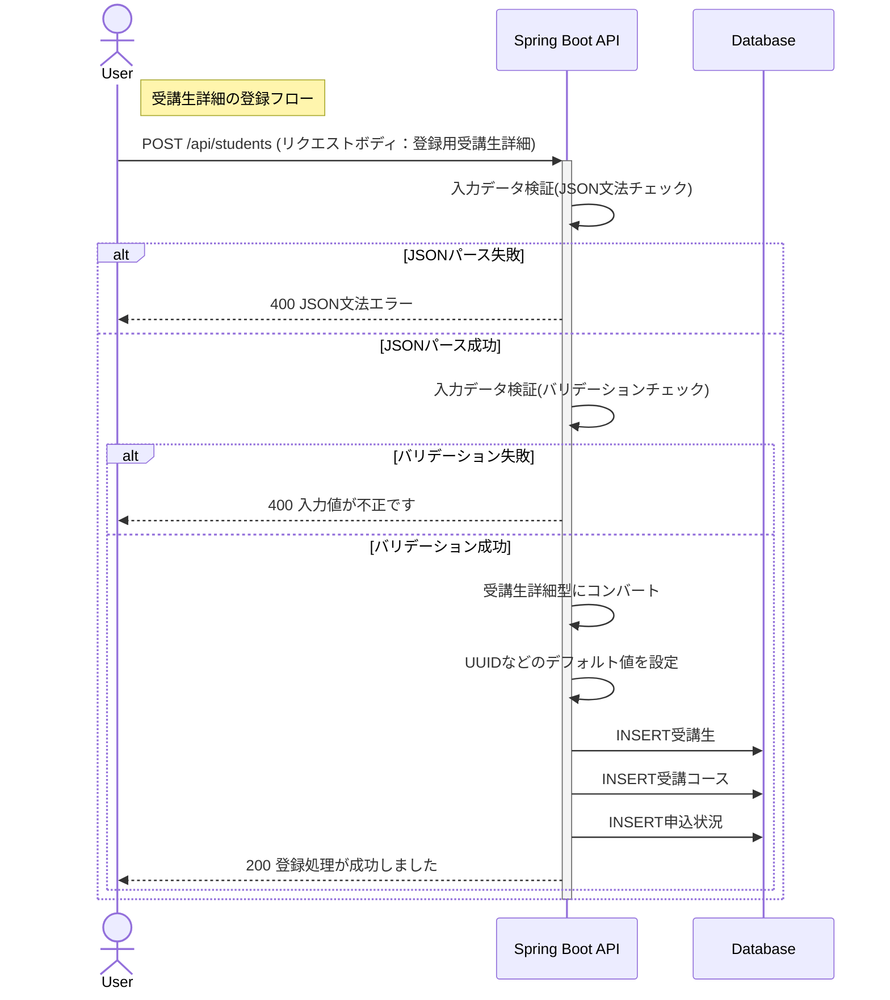
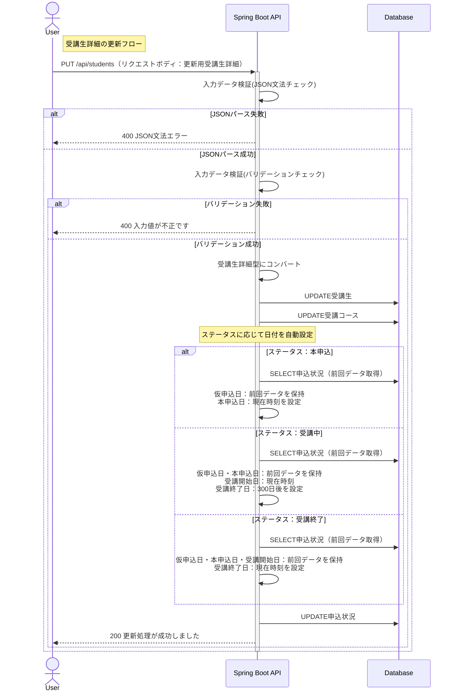

▶ デモサイト  
https://app.mitsuyonagaya-dev.com/

※ 就活用のためデータはダミーです
# 目次


 
- [1. 受講生管理システムの概要](#1-受講生管理システムの概要)
- [2. 技術スタック](#2-技術スタック)
- [3. 機能一覧](#3-機能一覧)
- [4. 画面・操作イメージ](#4-画面操作イメージ)
- [5. システム設計](#5-システム設計)
  - [5-1. ディレクトリ構成](#5-1-ディレクトリ構成)
  - [5-2. API設計](#5-2-api設計)
  - [5-3. データ設計：ER図](#5-3-データ設計er図)
  - [5-4. 処理設計：シーケンス図](#5-4-処理設計シーケンス図)
- [6. 開発・実行方法](#6-開発実行方法)
  - [6-1. 環境構築・起動方法](#6-1-環境構築起動方法)
  - [6-2. 外部ライブラリ・フレームワークとその選定理由](#6-2-外部ライブラリフレームワークとその選定理由)
- [7. テスト（バックエンド）](#7-テストバックエンド)
- [8. インフラ構成図](#8-インフラ構成図)
- [9. 工夫した点・力を入れた点](#9-工夫した点力を入れた点)
- [10. 今後の展望](#10-今後の展望)


# 1. 受講生管理システムの概要

Webアプリケーションを開発する中で一通りのスキルセットを身に着けるために、参考アプリとして作成しました。<br>
IT技術を教える学校が受講生の情報を保持・分析するための管理システムです。  <br>
学校運営者が使用することを想定しており、CRUD操作中心のシンプルで使いやすい設計を目指しています。


# 2. 技術スタック

### バックエンド


### フロントエンド


### データベース


### 使用ライブラリ・仕様技術


### インフラ / CI・CD


### 使用ツール


# 3. 機能一覧

| 機能       | 詳細                            |
|:---------|:----------------------------------------------------------------|
| 受講生詳細の条件検索 | 氏名・コース・申込状況など複数テーブルを跨ぐ検索条件を指定し、条件に該当する**受講生詳細**を取得します<br/>※リクエストはクエリパラメータで個別フィールドを指定     |      |
| 受講生詳細の新規登録 | 氏名や居住地域などの**受講生**の情報と、**受講コース**・**申込状況** をセットで登録します<br/>※リクエストには**登録用受講生詳細**を使用          |
| 受講生詳細の更新 | IDを指定し、任意の**受講生詳細**を更新します<br/>※リクエストには**更新用受講生詳細**を使用<br/>※削除処理については論理削除として実装しているため、更新処理として行います |

<details><summary>言葉の定義はこちら</summary>

- **受講生**：氏名、居住地域、年齢などをもつオブジェクト
- **受講コース**：受講コース名をもつオブジェクト（受講生に対して1：多の関係）
- **申込状況** ：仮申込、本申込といった申込状況、開始日などをもつオブジェクト
- **受講生詳細**：上記3つを統合したオブジェクト <br/>※DBでは正規化されて3テーブルに分離していますが、APIでは統合した形で扱います
- **登録用受講生詳細**：新規登録時のリクエストボディ
- **更新用受講生詳細**：更新時のリクエストボディ
</details>

[目次に戻る](#目次)

# 4. 画面・操作イメージ
## 4-1. 受講生一覧画面（赤字：ボタン押下による実行内容）


## 4-2. モーダル一覧


## 4-3. 使用時操作動画
<details><summary>条件検索</summary>
 
https://github.com/user-attachments/assets/e6285355-fe4e-47d5-ac0f-03acbd22c322
</details>
<details><summary>新規登録</summary>
 
https://github.com/user-attachments/assets/7ad96b5d-b17e-4108-9346-9c9808d0b051
</details>
<details><summary>更新</summary>
 
https://github.com/user-attachments/assets/6401f9d6-a052-4b8a-818b-4fb44914e7cd
</details>
<details><summary>削除</summary>
 
https://github.com/user-attachments/assets/c69faf30-0bcd-451a-93c8-c3c86382eb62
</details>

[目次に戻る](#目次)

# 5. システム設計

## 5-1. ディレクトリ構成

```
.
├─ frontend/                    # フロントエンド（React）
│  └─ src/
│     ├─ api/                       # API通信処理
│     ├─ components/                # 再利用可能なUIコンポーネント
│     ├─ pages/                     # 画面単位のコンポーネント
│     ├─ types/                     # 型定義
│     ├─ App.tsx
│     ├─ main.tsx
│     └─ main.css
└─ backend/                     # バックエンド（Spring Boot）
   └─ src/
      └─ main/java/raisetech.student.management/
         ├─ controller/             # リクエスト受付（APIエンドポイント）
         ├─ service/                # ビジネスロジック
         ├─ repository/             # DBアクセス
         ├─ converter/              # Data ⇔ Domain / DTO 変換
         ├─ data/                   # DBから取得するデータ構造
         ├─ domain/                 # アプリケーション内部のドメインモデル
         ├─ dto/                    # フロントエンドとの受け渡し用DTO
         └─ exceptionhandler/       # 例外ハンドリング
```

[目次に戻る](#目次)

## 5-2. API設計

### 5-2-1. API仕様書


<details><summary>条件検索の仕様書画面</summary>


</details>

<details><summary>新規登録の仕様書画面</summary>


</details>

<details><summary>更新の仕様書画面</summary>


</details>

### 5-2-2. APIのURL設計

| HTTP<br/>メソッド | URL                                 | 処理内容                                  | 
|---------------|-------------------------------------|---------------------------------------|
| GET           | /api/students                           | 受講生詳細の取得　クエリパラメータで条件の指定が可能です | 
| POST          | /api/students                           | 新規受講生と新規受講コースの登録               |
| PUT           | /api/students                           | 受講生詳細の更新                              |


[目次に戻る](#目次)

## 5-3. データ設計：ER図



[目次に戻る](#目次)

## 5-4. 処理設計：シーケンス図

#### 受講生の条件検索フロー


#### 受講生詳細の登録フロー


#### 受講生詳細の更新フロー


[目次に戻る](#目次)

# 6. 開発・実行方法

## 6-1. 環境構築・起動方法

### 前提条件
- Node.js v24 以上
- npm
- Java 21
- MySQL 8.x

### バックエンド起動
```bash
cd backend
./gradlew bootRun
```

### フロントエンド起動（開発環境）
```bash
cd frontend
npm install
npm run dev
```

### フロントエンドビルド（S3配置用）
```bash
npm run build
```

[目次に戻る](#目次)

## 6-2. 外部ライブラリ・フレームワークとその選定理由

### Backend

| 技術             | 目的                               |
| ----------------- | -------------------------------- |
| Spring Boot       | REST API を迅速に構築するため              |
| Spring Validation | リクエストパラメータ・リクエストボディの入力検証を行うため    |
| MyBatis           | SQL を明示的に管理し、複雑な検索条件にも柔軟に対応するため  |
| MySQL Connector   | MySQL データベースと接続するため              |
| Springdoc OpenAPI | API 仕様を自動生成し、フロントエンドとの連携を容易にするため |
|Apache Commons Lang|文字列操作やユーティリティ機能を利用するため|
| Lombok            | getter / setter などの定型コードを書く量を減らすため      |
| Spring Boot Starter Tomcat | アプリケーションサーバー（Tomcat）として動作させるため |
| Spring Boot Starter Test | Spring Boot アプリケーションのテストを行うため |
| MyBatis Spring Boot Starter Test | MyBatis を用いたリポジトリ層のテストを行うため |
| JUnit Platform Launcher | JUnit テストを実行するため |
| H2 Database       | テスト・ローカル検証用のインメモリ DB として利用するため   |


### Frontend


| 技術               | 目的                                    |
| ------------------- | ------------------------------------- |
| React               | UI をコンポーネント単位で管理し、再利用性・保守性を高めるため      |
| React Router DOM    | 画面遷移を URL ベースで管理し、SPA としての操作性を向上させるため |
| React Icons         | アイコンをコンポーネントとして扱い、UI の視認性を向上させるため     |
| TypeScript          | 型安全性を確保し、バグの早期発見と保守性向上を図るため           |
| Vite                | 開発サーバー起動およびビルドを高速化するため                |
| ESLint              | コードの静的解析を行い、品質を一定に保つため                |
| Prettier（ESLint 経由） | コードフォーマットを統一するため                      |


[目次に戻る](#目次)

# 7. テスト（バックエンド）
以下のテストをJUnit5で実装し、動作を検証しています。<br>


[目次に戻る](#目次)

# 8. インフラ構成図


▶ デモサイト
https://app.mitsuyonagaya-dev.com/


[目次に戻る](#目次)

# 9. 工夫した点・力を入れた点
## 🔶要件定義の見直し：クライアントが使いやすく、かつ保守性の高い仕様の追求


以下のプロセスで当初予定していた要件定義に変更を加えました。

**1. ver1に対する疑問**  <br>
 - 受講生コース情報と申込状況が1：1の関係である意味
 - この2つのテーブルは統合したほうが実装がシンプルなのではないか？
 - では、それぞれのテーブルの責務はなんだろうか？

**2. 責務の分析**  <br>
- **受講生コース情報**：受講生とコースの1：多の関係を管理。静的なコース属性（コース名など）を保持。
- **申し込み状況**：更新頻度が高く、動的に変化するデータを管理。業務上のトリガー判断（リマインド送信、教材送付など）の基準として使用される想定。拡張性も必要。
- **ver1の課題①（クライアント視点）**：動的データが2つのテーブルに分散しており、データ管理が非効率。
- **ver1の課題②（開発者視点）**：テーブルの責務境界が不明確で、機能拡張時の設計判断が困難。
- **改善案**：動的データ（日付情報）を申込状況テーブルに集約し、責務を明確化。

**3. 改善によるメリット**  <br>
|  | クライアント目線 | 開発者目線 |
|---|---|---|
| **ver1** | 日付情報が2項目のみで、申込状況の追跡が不十分 | テーブルの責務が曖昧で、拡張時の判断が困難 |
| **ver2** | 4つの申込状況すべての日付を管理可能 | 責務が明確になり、保守性が向上 |

**4. 上記を現役エンジニアのメンターに相談し、ver2の実装へ**  <br>

## 🔶ユースケースに基づいた設計
- **データ活用の観点からの設計**  <br>
分析に活用することを想定し、既存のレコードを保持するようなDB処理を行っています。  <br>
具体的には、「受講生の削除機能をUPDATE処理を使い論理削除として実装」といった対応をしており、以下のようなデータ活用が可能です。
  - 退会者属性の傾向を分析し、マーケティングに役立てる。
  - 退会者数をKPIとしてモニタリングし、一定水準を下回った場合に早期に着手できるようにする。

- **業務効率化とヒューマンエラー防止**  <br>
運営管理者の業務フローを想定し、手動入力によるミスを防ぐ設計を実装しています。  <br>
具体的には、以下の自動化処理により、データの正確性を担保しています。
  - ステータス変更時の日付自動設定：申込状況が更新されると、該当する日付（仮申込日・本申込日・受講開始日など）を更新時点の日付に自動で記録。
  - プライマリーキーの自動採番：登録時にUUID・連番IDを自動生成し、管理者の入力負担を軽減。

## 🔶コード品質・保守性を考慮した設計
- **効果的なバリデーション、例外処理**<br>
バリデーションに正規表現などを活用し、データの整合性を確保しました。<br>
また、エラーがあった際にユーザーが適切に修正できるよう、 バリデーションエラー(クエリパラメータ、リクエストボディ)、JSON文法エラーなどのハンドリングを行い、クライアント側にエラーメッセージが表示されるようにしました。

- **実装意図が伝わりやすいコーディング・ドキュメント作成**<br>
具体的には以下の3点を行いました。
    - コード内でのドキュメント作成：主要なクラス・メソッドにJavadocやOpenAPIアノテーションを利用したドキュメントを記述しました。
    - 命名へのこだわり: クラス名やメソッド名に挙動が想像しやすい言葉を選定し、可読性を向上させました。
    - 読みやすいレビュー依頼: プルリクエストでのレビュー依頼時に概要を把握しやすいよう、変更点・変更目的・特にレビューいただきたい箇所などを明示しました。

- **テストの責務分離**<br>
コントローラ層のテスト肥大化を防ぐため、以下のようにテストの責務を整理しました。これにより、各層の責務が明確になり、テストの保守性が向上しました。
  - DTOクラス：正常系はコントローラ層、異常系はDTOクラス単位
  - 内部処理用クラス：すべてオブジェクトクラス単位

[目次に戻る](#目次)

# 10. 今後の展望
- 全体に関わる改修
  - 2つ目以降の受講コース追加機能の実装
  - 日付の手動変更の実装
  - 登録・更新に専用のDTOが本当に必要か検討
  - コース名をenum型に変更し、enumに新規開校コース追加・旧コース削除ができるようにする
  - ログイン機能の実装

- インフラ環境の構築
    - Docker導入

- バックエンドの修正
  - 認証機能の実装
  - エラーハンドリングの見直し

- フロントエンドの修正
  - コース一覧画面の追加
  - フィルター機能の追加
  - リファクタリングが必要
    - コンポーネント設計の見直し（再利用性・保守性の向上）
    - 命名規則の統一とコードの整理
    - 状態管理の最適化


[目次に戻る](#目次)


