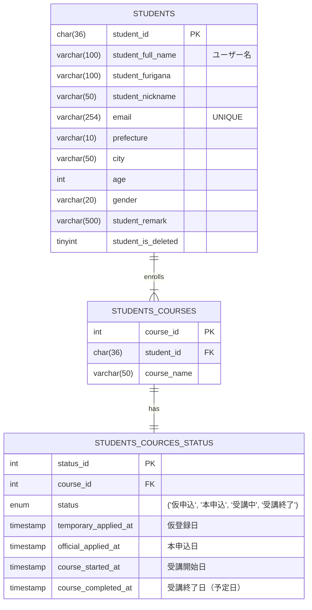
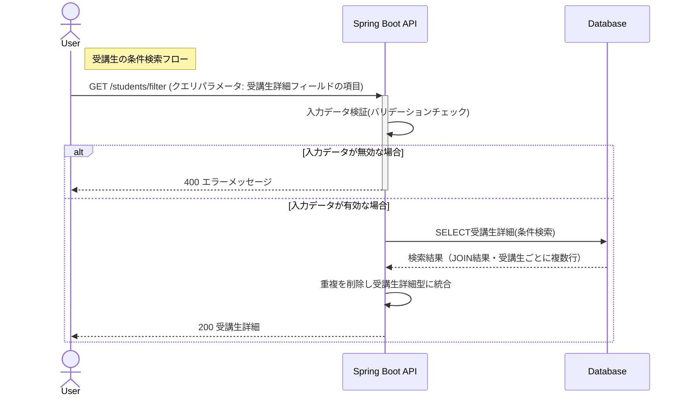
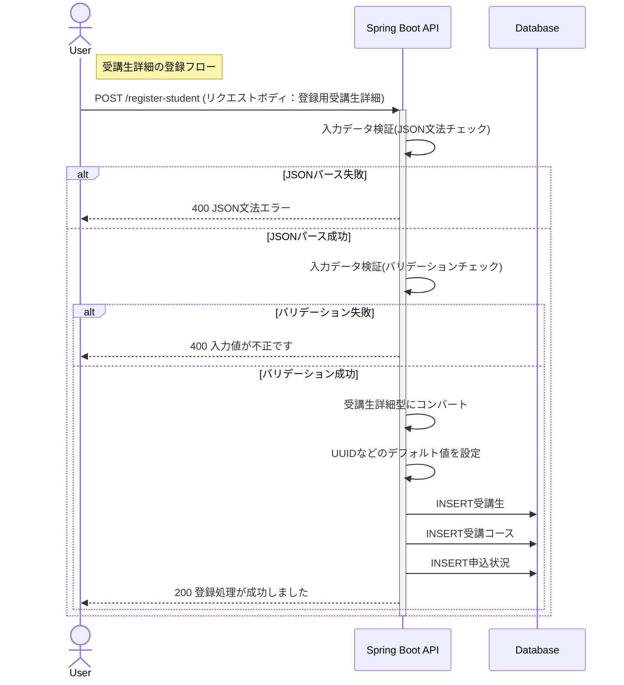
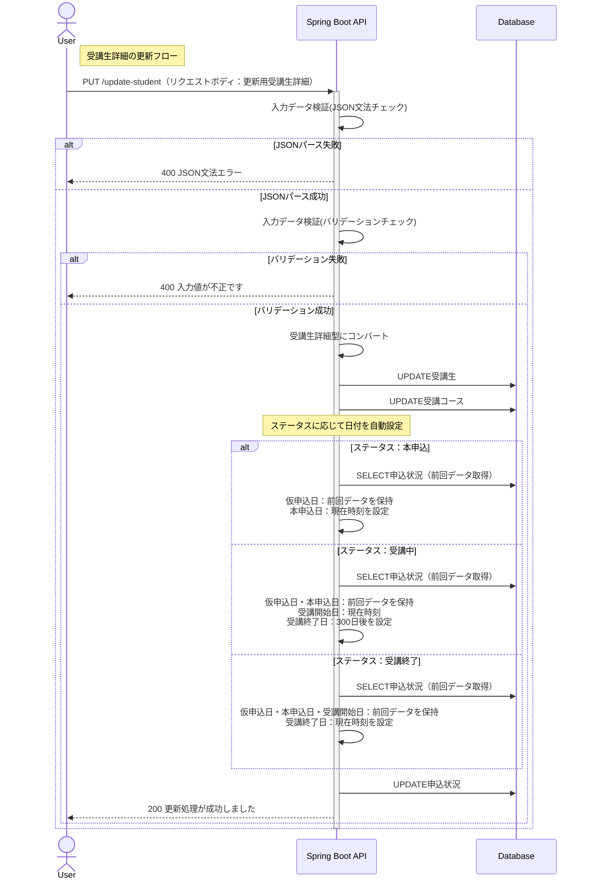

## 目次
1. [サービス概要](#サービス概要)
2. [作成背景](#作成背景)
3. [主な使用技術](#主な使用技術)
4. [機能一覧](#機能一覧)
5. [使用イメージ](#使用イメージ)
6. [設計書](#設計書)
7. [テスト](#テスト)
8. [力をいれたところ](#力をいれたところ)
9. [今後の展望](#今後の展望)
 
## サービス概要

このプロジェクトは、IT技術を教えるスクールが受講生の情報を保持・分析するための管理システムです。  
スクール運営者が使用することを想定しており、CRUD操作中心のシンプルで使いやすい設計を目指しています。

## 作成背景

Java/Spring Bootを教えるプログラミングスクールで学んだ内容を、学習成果として形にするために作成しました。

### 講座での学習内容
- **実装スタイル**：「先に自分で実装 → プルリクエストでレビュー → 講師の解説」という流れで開発
- **習得技術**：REST API設計、テスト駆動開発など実務で頻繁に使用される技術

### 独自で追加実装した内容
- **機能拡張**：講座の要件定義に対し、新たな機能（後述💡マーク）を独自に実装。DB設計から見直し、CRUD処理をすべて再実装
- **フロントエンド開発**：バックエンドAPIの動作確認と実務での連携を想定し、TypeScript/Reactで実装（基礎文法を独学後、AIを活用して実装）

## 主な使用技術

### バックエンド

### フロントエンド

### データベース・O/Rマッパー

### 使用ツール

## 機能一覧
※💡：機能拡張

| 機能       | 詳細                            |
|:---------|:----------------------------------------------------------------|
| 受講生の全件検索 | すべての**受講生詳細**を取得します   |
| 受講生詳細の条件検索 💡 | 氏名・コース・申込状況など複数テーブルを跨ぐ検索条件を指定し、条件に該当する**受講生詳細**を取得します ※リクエストはクエリパラメータで個別フィールドを指定     |      |
| 受講生詳細の新規登録 | 氏名や居住地域などの**受講生**の情報と、**受講コース**・**申込状況** をセットで登録します ※リクエストには**登録用受講生詳細**を使用          |
| 受講生詳細の更新 | IDを指定し、任意の**受講生詳細**を更新します ※リクエストには**更新用受講生詳細**を使用 ※削除処理については論理削除として実装しているため、更新処理として行います |

※ 言葉の定義は以下のとおりです

- **受講生**：氏名、居住地域、年齢などをもつオブジェクト
- **受講コース**：受講コース名をもつオブジェクト（受講生に対して1：多の関係）
- **申込状況** 💡：仮申込、本申込といった申込状況、開始日などをもつオブジェクト
- **受講生詳細**：上記3つを統合したオブジェクト ※DBでは正規化されて3テーブルに分離していますが、APIでは統合した形で扱います
- **登録用受講生詳細**：新規登録時のリクエストボディ
- **更新用受講生詳細**：更新時のリクエストボディ

## 使用イメージ
### 受講生一覧画面

#### 受講生詳細画面
https://github.com/user-attachments/assets/10ec51f3-40cf-4051-bac3-33178116f553

### 条件検索
https://github.com/user-attachments/assets/e6285355-fe4e-47d5-ac0f-03acbd22c322

### 新規登録
https://github.com/user-attachments/assets/7ad96b5d-b17e-4108-9346-9c9808d0b051

### 更新
https://github.com/user-attachments/assets/6401f9d6-a052-4b8a-818b-4fb44914e7cd

### 削除
https://github.com/user-attachments/assets/c69faf30-0bcd-451a-93c8-c3c86382eb62

## 設計書

### API仕様書

全件検索の仕様書画面

条件検索の仕様書画面

新規登録の仕様書画面

更新の仕様書画面

### ER図

### APIのURL設計

| HTTP メソッド | URL                                 | 処理内容                                  | 
|---------------|-------------------------------------|---------------------------------------|
| GET           | /students                           | 受講生詳細の取得 | 
| GET           | /students/filter                      | 条件検索後の受講生詳細の取得　クエリパラメータで指定します                     |
| POST          | /register-student                           | 新規受講生と新規受講コースの登録                              |
| PUT           | /update-student                           | 受講生詳細の更新                              |

### シーケンス図

#### 受講生の条件検索フロー

#### 受講生詳細の登録フロー

#### 受講生詳細の更新フロー

## テスト
以下のテストをJUnit5で実装し、動作を検証しています。 

## 力をいれたところ
### 🔶仕様の妥当性検証と変更提案
自作課題で与えられた元の仕様に対し、責務の整理を行った上で技術的妥当性とビジネス要件への適合性に関する変更提案を行いました。変更に伴い、講師・メンターとの双方向のやり取りを行いました。

具体的には以下の変更を行い、「クライアントが使いやすく、かつ保守性の高い仕様」に改善することができました。
- 受講開始日・受講終了日を受講生コース情報から申込状況に移動
- 申込状況に仮申込日と本申込日を追加

仕様変更詳細

**受講生コース情報の定義**
- ID
- 受講生情報のID
- コース名
- ❌削除：~~受講開始日~~
- ❌削除：~~受講修了予定日~~

**申し込み状況の定義**
- ID
- 受講生コース情報のID
- 申込状況
- ✅追加：仮申込日
- ✅追加：本申込日
- ✅移動：受講開始日
- ✅移動：受講終了日

改善点詳細

|  | クライアント目線 | シンプルな実装・責務を明確にした実装 |
|---|---|---|
| **元の仕様** | 受講中・受講修了の2つの日付情報のみの登録に留まっていた | カラムを増やしたいという要望が来たときにどっちのDBに追加すべきか分かりづらかった |
| **変更後** | 4つの申し込み状況すべての日付情報が管理可能になった それに伴い、ビジネス課題に対するデータ管理がしやすくなった | DBの責務に沿って、カラムの追加・削除に柔軟に対応できるようになり、保守性が高まった |

仕様変更に至ったプロセス

**1. 課題の発見**  
受講生コース情報と申込状況が1：1の関係であることに着目し、「2つのDBに分けている理由」について思考した結果、「テーブルを統合できるのではないか」という疑問を持ちました。

**2. 責務の分析**  
両テーブルの役割を整理し、分離の妥当性を検証しました。
- **受講生コース情報**：受講生とコースの1：多の関係を管理。静的なコース属性（コース名など）を保持
- **申込状況**：更新頻度が高く、動的に変化するデータを管理。業務上のトリガー判断（リマインド送信、教材送付など）の基準として使用される想定。拡張性も必要

**3. 改善案の検討**  
分析の結果、日付情報は「申込状況」で一元管理すべきと判断しました。
- **変更内容**：受講開始日・受講終了日を受講生コース情報から申込状況に移動
- **理由**：日付は申込の進行状況に紐づく動的データであり、コースの静的属性とは性質が異なる

**4. メンターへの相談**  
講師・メンターに変更案を提示し、技術的妥当性とビジネス要件への適合性を確認しました。

**5. 最終決定**  
承認を得て、課題の要件定義から一部仕様を変更し、独自の設計を採用しました。

### 🔶ユースケースに基づいた設計
- **データ活用の観点からの設計**   
分析に活用することを想定し、既存のレコードを保持するようなDB処理を行っています。   
具体的には、「受講生の削除機能をUPDATE処理を使い論理削除として実装」といった対応をしており、以下のようなデータ活用が可能です。
  - 退会者属性の傾向を分析し、マーケティングに役立てる
  - 退会者数をKPIとしてモニタリングし、一定水準を下回った場合に早期に着手できるようにする

- **業務効率化とヒューマンエラー防止**   
運営管理者の業務フローを想定し、手動入力によるミスを防ぐ設計を実装しています。   
具体的には、以下の自動化処理により、データの正確性を担保しています。
  - ステータス変更時の日付自動設定：申込状況が更新されると、該当する日付（仮申込日・本申込日・受講開始日など）を更新時点の日付に自動で記録
  - プライマリーキーの自動採番：登録時にUUID・連番IDを自動生成し、管理者の入力負担を軽減

### 🔶コード品質・保守性を考慮した設計
- **効果的なバリデーション、例外処理** 
バリデーションに正規表現などを活用し、データの整合性を確保しました。 
また、エラーがあった際にユーザーが適切に修正できるよう、 バリデーションエラー(クエリパラメータ、リクエストボディ)、JSON文法エラーなどのハンドリングを行い、クライアント側にエラーメッセージが表示されるようにしました。

- **実装意図が伝わりやすいコーディング・ドキュメント作成** 
具体的には以下の3点を行いました。
    - コード内でのドキュメント作成：主要なクラス・メソッドにJavadocやOpenAPIアノテーションを利用したドキュメントを記述しました
    - 命名へのこだわり: クラス名やメソッド名に挙動が想像しやすい言葉を選定し、可読性を向上させました
    - 読みやすいレビュー依頼: プルリクエストでのレビュー依頼時に概要を把握しやすいよう、変更点・変更目的・特にレビューいただきたい箇所などを明示しました

- **テストの責務分離** 
コントローラ層のテスト肥大化を防ぐため、以下のようにテストの責務を整理しました。これにより、各層の責務が明確になり、テストの保守性が向上しました。
  - DTOクラス：正常系はコントローラ層、異常系はDTOクラス単位
  - 内部処理用クラス：すべてオブジェクトクラス単位

## 今後の展望
- 全体に関わる改修
  - 受講コース追加機能の実装
  - 日付の手動変更の実装
  - 登録・更新に専用のDTOが本当に必要か検討
  - コース名をenum型に変更、enumにコース追加・削除できるようにする

- インフラ環境の構築（スクールにて現在学習中）
    - AWSへのデプロイ（EC2、RDS、ELB）
    - CI/CDパイプライン構築（GitHub Actions）
    - Docker導入

- バックエンドの修正
  - 認証機能の実装
  - エラーハンドリングの見直し

- フロントエンドの修正
  - コース一覧画面の追加
  - フィルター機能の追加
  - AIを活用し短期間で作成したため、以下のリファクタリングが必要
    - コンポーネント設計の見直し（再利用性・保守性の向上）
    - 命名規則の統一とコードの整理
    - 状態管理の最適化

