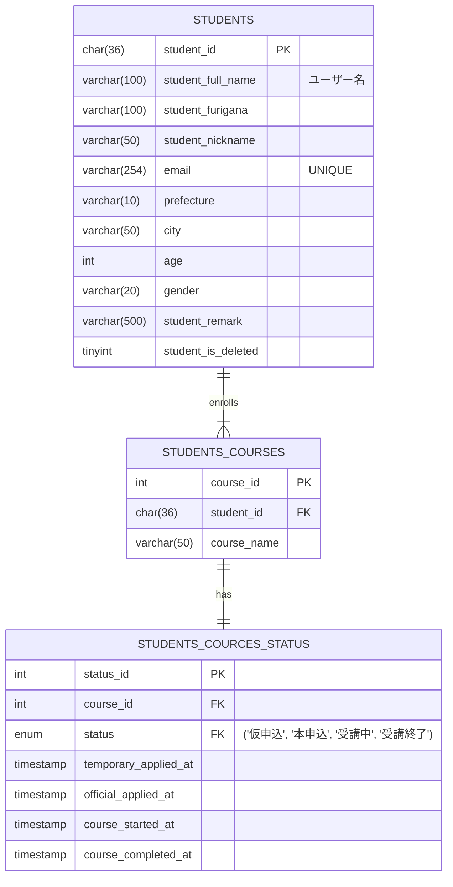
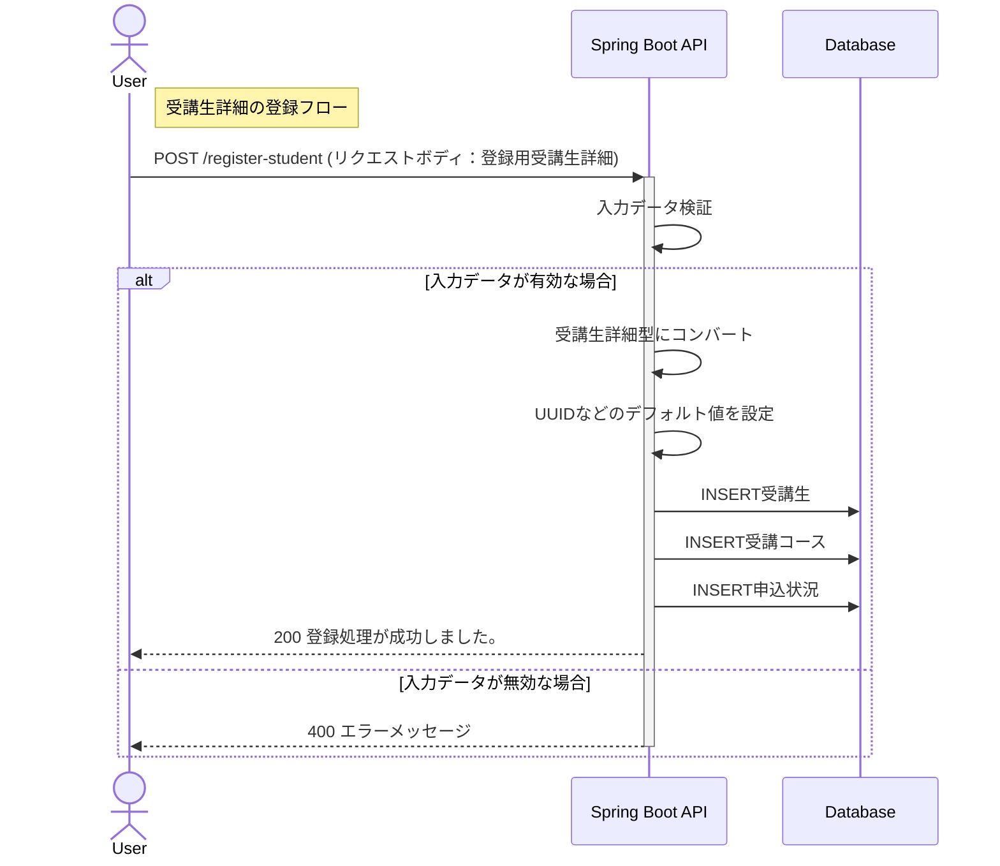
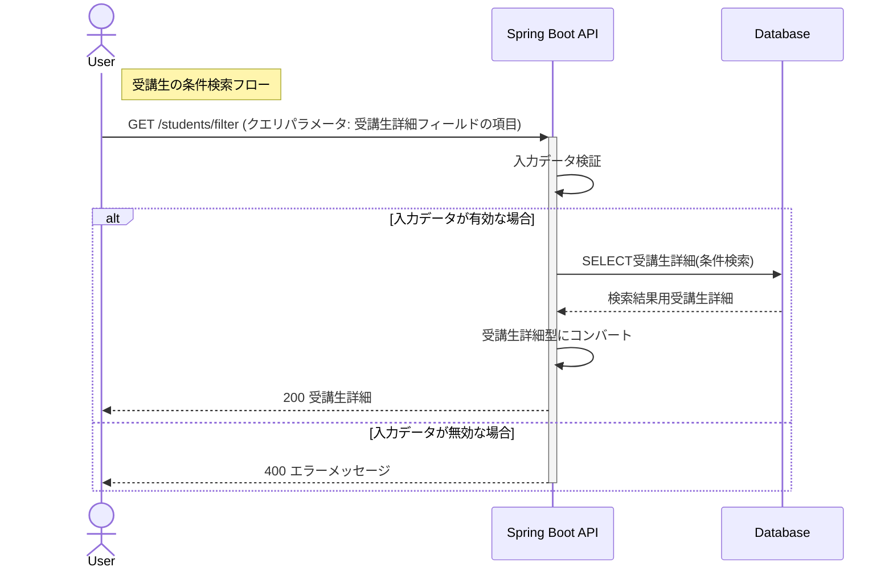
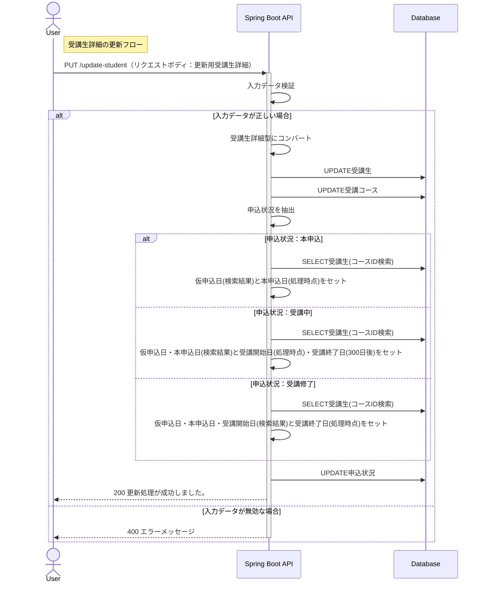

## サービス概要

このプロジェクトは、IT技術を教えるスクールが受講生の情報を保持・分析するための管理システムです。  
スクール運営者が使用することを想定しており、CRUD操作中心のシンプルで使いやすい設計を目指しています。

## 作成背景

JavaやSpring Bootの学習成果を形にするために作成しました。  
実務で頻繁に使用される以下の技術やツールを採用しています。

- REST APIの設計と実装: データのCRUD操作をサポート
- 自動テスト: JUnitを使用して単体テストを実装
- AWSを使用したデプロイ: クラウド環境へのアプリケーション展開

## 主な使用技術

### バックエンド

### フロントエンド

### データベース・O/Rマッパー

### 使用ツール

## 機能一覧

| 機能       | 詳細                                                              |
|:---------|:----------------------------------------------------------------|
| 受講生詳細の登録 | 氏名や居住地域などの受講生の情報と、受講コース・申込状況をセットで登録します                          |
| 受講生詳細の条件検索 | 氏名・居住地域・コース・申込状況などの検索条件を指定し、条件に該当する受講生詳細を取得します　                          |                                      |
| 受講生のID検索 | IDを指定し、一意の受講生詳細を取得します                                           |
| 受講生詳細の更新 | IDを指定し、任意の受講生詳細を更新します ※削除処理については論理削除として実装しているため、更新処理として行います |

※ 言葉の定義は以下のとおりです

- 受講生： 氏名、居住地域、年齢などをもつオブジェクト
- 受講コース： 受講コース名をもつオブジェクト
- 申込状況： 仮申込,本申込といった申込状況、開始日などをもつオブジェクト
- 受講生詳細： 受講生、受講コース（申込状況含む）をもつオブジェクト

## 使用イメージ
### 受講生一覧画面

#### 受講生詳細画面
https://github.com/user-attachments/assets/10ec51f3-40cf-4051-bac3-33178116f553

### 条件検索
https://github.com/user-attachments/assets/e6285355-fe4e-47d5-ac0f-03acbd22c322

### 新規登録
https://github.com/user-attachments/assets/6496a131-aaf4-449d-a289-4806e3c6b276

### 更新
https://github.com/user-attachments/assets/6401f9d6-a052-4b8a-818b-4fb44914e7cd

### 削除

## 設計書

### API仕様書
https://github.com/user-attachments/assets/b7d6f6a9-2015-40b7-9228-ddb45f6fcbc5

### ER図

### APIのURL設計

| HTTP メソッド | URL                                 | 処理内容                                  | 
|---------------|-------------------------------------|---------------------------------------|
| POST          | /register-student                           | 受講生詳細の作成                              |
| GET           | /students                           | 受講生詳細の取得 | 
| GET           | /students/filter                      | 条件検索後の受講生詳細の取得   クエリパラメータで指定します                     |
| PUT           | /update-student                           | 受講生詳細の更新                              |

### シーケンス図

#### 受講生詳細の登録フロー

#### 受講生の条件検索フロー

#### 受講生詳細の更新フロー

## テスト
以下のテストをJUnit5で実装し、動作を検証しています。 

## 力をいれたところ
### 🔶仕様の妥当性検証と変更提案
自作課題として与えられた要件定義に対し、以下のフローで変更の提案を行いました。
- **疑問**：受講生コース情報と申込状況のDBが1：1であるならば、これらを分ける必要性は何か？
- **責務を整理**
  - 受講生コース情報：受講生とコースの関係が1：多であることを想定して管理するために必要。静的なコース属性。
  - 申し込み状況：更新頻度が高いDBであり、動的に変化する。 管理者はこのDBから、業務上のトリガー判断（申し込みリマインド送信、教材送付など）をすることが多いと想定。 申し込み状況の拡張もしやすい。
- **自己判断**：ユーザー視点から考えると、受講生コース情報と申込状況の定義の変更が必要ではないか？
- **相談**：講師・メンターに直接質問
- **結果**：仕様の一部を課題とは異なる独自の仕様に変更
    

🔄仕様変更結果

    - 受講生コース情報の定義
        - ID
        - 受講生情報のID
        - コース名
        - ❌削除：~~受講開始日~~
        - ❌削除：~~受講修了予定日~~
    - 申し込み状況の定義
        - ID
        - 受講生コース情報のID
        - 申込状況
        - ✅追加：仮申込日
        - ✅追加：本申込日
        - ✅追加：受講開始日
        - ✅追加：受講終了日
    

### 🔶ユースケースに基づいた設計
- データ活用
分析に活用することを想定し、既存のレコードを保持するようなDB処理を行っています。 
具体的には、「受講生の削除機能をUPDATE処理を使い論理削除として実装」といった対応をしています。これにより、以下のようなデータ活用が可能です。
  - 退会者属性の傾向を分析し、マーケティングに役立てる
  - 退会者数をKPIとしてモニタリングし、一定水準を下回った場合に早期に着手できるようにする

- 業務フロー
また、ヒューマンエラーの起きにくいシステムを想定した実装をすることで、ユーザーの業務フローに対しニーズの高い開発を意識しています。具体的には、「各ステータスの日付の自動取得」、「3つのIDの自動採番・自動取得」を行っています。
  - 問い合わせが来たら自動で仮申込状態に登録
  - 教材システムに初めて受講生がアクセスしたら自動で受講中に更新
  - 登録時に自動でプライマリーキーを設定

### 🔶コード品質・保守性を考慮した設計
- 効果的なバリデーション、例外処理
バリデーションに正規表現などを活用し、データの整合性を確保しました。 
また、エラーがあった際にユーザーが適切に修正できるよう、 バリデーションエラー、意図していない操作をされた際のBadRequestエラーなどのハンドリングを行い、クライエント側にエラーメッセージが表示されるようにしました。

- 実装意図が伝わりやすいコーディング・ドキュメント作成
具体的には以下の3点を行いました
    - コード内でのドキュメント作成：主要なクラス・メソッドにJavadocやOpenAPIアノテーションを利用したドキュメントを記述しました
    - 命名へのこだわり: クラス名やメソッド名に挙動が想像しやすい言葉を選定し、可読性を向上させました
    - 読みやすいレビュー依頼: プルリクエストでのレビュー依頼時に概要を把握しやすいよう、変更点・変更目的・特にレビューいただきたい箇所などを明示しました

- テストの責務分離
コントローラ層のテスト肥大化を防ぐため、以下のようにテストの責務を整理しました。これにより、各層の責務が明確になり、テストの保守性が向上しました。
  - DTOクラス：正常系はコントローラ層、異常系はDTOクラス単位
  - 内部処理用クラス：すべてオブジェクトクラス単位

## 今後の展望
- 全体に関わる改修
  - 受講コース追加機能の実装
  - 日付の手動設定・変更の実装
  - 登録・更新に専用のDTOが本当に必要か検討

- インフラ環境の構築（学習予定）
    - AWSへのデプロイ（EC2、RDS、ELB）
    - CI/CDパイプライン構築（GitHub Actions）
    - Docker導入

- バックエンドの修正
  - 認証機能の実装

- フロントエンドの修正
    - コース一覧画面の追加
    - フィルター機能の追加
    - AIを活用し短期間で作成したため、以下のリファクタリングが必要
      - コンポーネント設計の見直し（再利用性・保守性の向上）
      - 命名規則の統一とコードの整理
      - 状態管理の最適化

